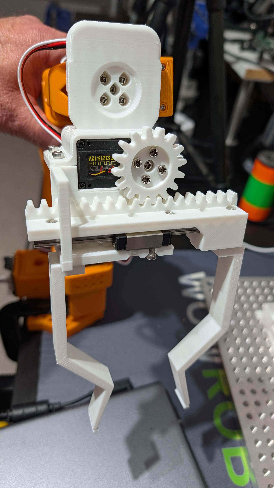

This is a 96-well plate gripper for the LeRobot SO-101 robot arm. Replaces the default gripper

It requires [this linear rail](https://www.amazon.com/dp/B0D54LNVKX?ref=ppx_yo2ov_dt_b_fed_asin_title). All the other parts are 3D printed.

Video in action is [here](https://photos.google.com/share/AF1QipNY5lr_5gRUSeayVD-G570qnp62bgbsUy9Bx73SZrKYlXrXLhb-zy0RN5-uwbevLw?key=Vnpqa0JpSmxEdG1jaUFyeV80ZTFvLWdlMEVRdlh3)
